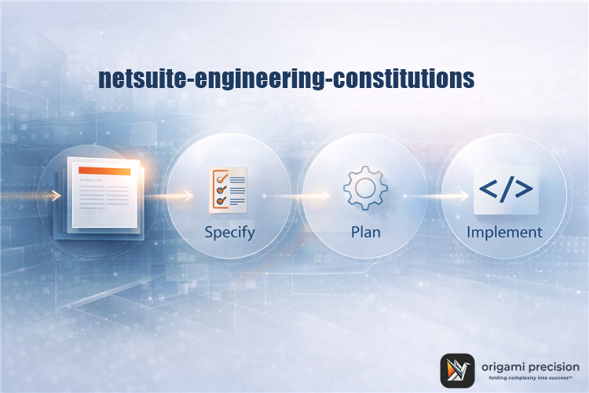

  

# netsuite-engineering-constitutions
Non-negotiable engineering constitutions for NetSuite systems, grounded in Specification-Driven Development (SDD).

## NetSuite Engineering Constitutions

This repository contains two **opinionated, production-tested Constitutions** for building and maintaining NetSuite systems using **Specification-Driven Development (SDD)**.
These documents define **non-negotiable invariants** — rules that must remain true across environments, integrations, teams, and tooling, including AI-assisted workflows.
They are provided as reusable references and are intended to be adapted to your organization’s standards.

---

## What’s in this repo

### 1) NetSuite SuiteScript Constitution (Universal)

**Scope:**  
All NetSuite SuiteScript development (Client Scripts, User Events, Suitelets,
Map/Reduce, Scheduled Scripts, Restlets, Workflow Actions).

**Focus areas:**
- behavior preservation and anti-rewrite rules
- record lifecycle safety
- governance and performance constraints
- canonical data handling (IDs, currency, subsidiaries)
- accounting, tax, and feature-dependency invariants
- AI-safe development guardrails

Use this when:
- writing or modifying SuiteScript
- reviewing PRs or change requests
- onboarding new engineers
- generating code with AI agents

---

### 2) NetSuite Integration Constitution (Universal)

**Scope:**  
All inbound and outbound integrations involving NetSuite, including REST, RESTlets, CSV pipelines, middleware, batch jobs, and backfills.

**Focus areas:**
- contract-first integration design
- idempotency and de-duplication
- currency, FX, tax, and subsidiary boundaries
- Chart of Accounts handling
- NetSuite feature dependencies (OneWorld, ARM, SuiteBilling, etc.)
- reconciliation, auditability, and recovery

Use this when:
- designing or changing integrations
- reviewing integration failures or drift
- onboarding vendors or partners
- generating integration logic with AI agents

---

## How the two Constitutions work together

- The **SuiteScript Constitution** governs *how code behaves inside NetSuite*.
- The **Integration Constitution** governs *how data crosses system boundaries*.

They intentionally overlap on **Canonical Data & Boundary Invariants**
(e.g., identifiers, currency, subsidiaries, tax, features) to ensure:
- consistency across layers
- no “it worked in the script but broke in the integration” gaps

If there is a conflict:
- Integration Constitution governs cross-system behavior
- SuiteScript Constitution governs in-account execution

---

## How to use these documents

Recommended practice:
1. Copy the Constitutions into your repo (unaltered or adapted)
2. Reference them from specs and ADRs
3. Use them as PR and design review guardrails
4. Require AI agents to read them before generating code
5. Treat invariant violations as defects, even if code “works”

These are **not checklists** — they are constraints.

---

## License & reuse

License: Creative Commons Attribution 4.0 International (CC BY 4.0).
These documents are provided **as-is**, free to reuse and adapt with attribution.

---

## Origin

Authored by **Joshua Meiri** at **Origami Precision** (https://www.origamiprecision.com/) to support NetSuite systems built with **Specification-Driven Development** and metadata-driven observability (origami lens: https://origamilens.com/).

Feedback and discussion are welcome.

---

## Attribution

Third-party trademarks mentioned in this document are the property of their respective owners.

NetSuite and Oracle are registered trademarks of Oracle Corporation.  
Codex is a trademark of OpenAI.  
Visual Studio Code and Microsoft are trademarks of Microsoft Corporation.

